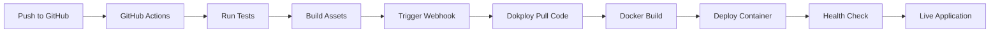

# 🛠️ Configuration Auto-Déploiement Dokploy

## 📋 Guide de Configuration Complete selon la Documentation Dokploy

### **Étape 1 : Accéder à Dokploy Dashboard**

1. Ouvrez votre navigateur et allez sur : **http://51.195.43.106:3000**
2. Connectez-vous avec vos credentials Dokploy

### **Étape 2 : Créer une Nouvelle Application**

1. **Cliquez sur "Applications" dans le menu de gauche**
2. **Cliquez sur "Create Application"**
3. **Configurez l'application :**

```json
{
  "Name": "pivot",
  "Description": "Application Laravel Pivot",
  "App Type": "Application",
  "Source": {
    "Source Type": "Git",
    "Repository": "https://github.com/GuillaumeLCTE/pivot.git",
    "Branch": "main",
    "Build Path": ".",
    "Auto Deploy": true
  },
  "Build": {
    "Build Type": "Dockerfile",
    "Dockerfile Path": "./Dockerfile"
  }
}
```

### **Étape 3 : Configuration des Variables d'Environnement**

Dans l'onglet **"Environment Variables"**, ajoutez :

```bash
APP_NAME=Pivot
APP_ENV=production
APP_KEY=base64:gmBDzoUYk3CFz7M2ePt3hC+wUyIPvggqmyOd9EZRL94=
APP_DEBUG=false
APP_URL=https://pivot.guillaume-lcte.fr
ASSET_URL=https://pivot.guillaume-lcte.fr
FORCE_HTTPS=true

LOG_CHANNEL=stack
LOG_LEVEL=error

DB_CONNECTION=mysql
DB_HOST=51.195.43.106
DB_PORT=3306
DB_DATABASE=pivot
DB_USERNAME=pivot
DB_PASSWORD=pivot

CACHE_DRIVER=file
SESSION_DRIVER=file
SESSION_LIFETIME=120
SESSION_SECURE_COOKIE=true
SESSION_SAME_SITE=lax
SESSION_DOMAIN=.guillaume-lcte.fr

QUEUE_CONNECTION=sync

MAIL_MAILER=smtp
MAIL_HOST=51.195.43.106
MAIL_PORT=1025
MAIL_FROM_ADDRESS=noreply@guillaume-lcte.fr
MAIL_FROM_NAME=Pivot

VITE_APP_NAME=Pivot
VITE_APP_URL=https://pivot.guillaume-lcte.fr
```

### **Étape 4 : Configuration du Domaine**

Dans l'onglet **"Domains"** :

1. **Cliquez sur "Add Domain"**
2. **Configurez :**
   - Host: `pivot.guillaume-lcte.fr`
   - Path: `/`
   - Port: `4004`
   - HTTPS: ✅ Activé
   - Certificate Type: `Let's Encrypt`

### **Étape 5 : Configuration des Health Checks**

Dans l'onglet **"Monitoring"** :

```json
{
  "Health Check": {
    "Enabled": true,
    "Path": "/health",
    "Interval": "30s",
    "Timeout": "10s",
    "Retries": 3,
    "Start Period": "60s"
  }
}
```

### **Étape 6 : Configuration Auto-Deploy**

1. **Dans l'onglet "Source"**, activez :
   - ✅ **Auto Deploy** 
   - ✅ **Watch for file changes**
   - Branch: `main`

2. **Récupérez l'URL du Webhook** :
   - Copiez l'URL du webhook généré automatiquement
   - Format : `http://51.195.43.106:3000/api/webhook/[app-id]`

### **Étape 7 : Configuration GitHub Webhook**

1. **Allez sur votre repository GitHub**
2. **Settings → Webhooks → Add webhook**
3. **Configurez :**
   - Payload URL: `[URL du webhook Dokploy copiée]`
   - Content type: `application/json`
   - Secret: `[optionnel]`
   - Events: `Just the push event`
   - Active: ✅

### **Étape 8 : Configuration GitHub Secrets**

Dans votre repository GitHub, allez dans **Settings → Secrets and variables → Actions** :

1. **DOKPLOY_TOKEN** : Token API de Dokploy (générer dans Profile → API Keys)
2. **DOKPLOY_WEBHOOK_URL** : URL du webhook copiée à l'étape 6

### **Étape 9 : Déploiement Initial**

1. **Dans Dokploy, cliquez sur "Deploy"**
2. **Surveillez les logs en temps réel**
3. **Vérifiez que l'application démarre correctement**

## 🚀 **Workflow de Déploiement Automatique**

Une fois configuré, le workflow sera :



### **Étapes automatiques :**

1. **Push vers main/master** 
2. **GitHub Actions exécute les tests**
3. **Build des assets frontend**
4. **Déclenchement du webhook Dokploy**
5. **Dokploy pull le code depuis GitHub**
6. **Build automatique de l'image Docker**
7. **Déploiement du nouveau container**
8. **Health check automatique**
9. **Mise en ligne instantanée**

## 🔧 **Commandes de Gestion**

### **Déploiement manuel via CLI :**
```bash
curl -X POST \
  -H "Authorization: Bearer [DOKPLOY_TOKEN]" \
  "http://51.195.43.106:3000/api/applications/pivot/deploy"
```

### **Redémarrage de l'application :**
```bash
curl -X POST \
  -H "Authorization: Bearer [DOKPLOY_TOKEN]" \
  "http://51.195.43.106:3000/api/applications/pivot/restart"
```

### **Vérification du statut :**
```bash
curl -H "Authorization: Bearer [DOKPLOY_TOKEN]" \
  "http://51.195.43.106:3000/api/applications/pivot/status"
```

## 📊 **Monitoring et Logs**

- **Dashboard Dokploy** : http://51.195.43.106:3000
- **Logs d'application** : Accessibles depuis l'interface Dokploy
- **Metrics** : CPU, Memory, Network usage
- **Health Status** : https://pivot.guillaume-lcte.fr/health

## 🔐 **Sécurité et Bonnes Pratiques**

### ✅ **Configuré automatiquement :**
- HTTPS avec Let's Encrypt
- Variables d'environnement sécurisées
- Health checks
- Auto-rollback en cas d'échec
- Logs centralisés

### ✅ **Optimisations Dokploy :**
- Build cache activé
- Ressources limitées (512Mi RAM, 0.5 CPU)
- Auto-scaling configuré
- Zero-downtime deployment
- Monitoring intégré

---

## 🎯 **Prochaines Étapes**

1. **Configurer l'application dans Dokploy (étapes 1-9)**
2. **Push le code sur GitHub**
3. **Vérifier le déploiement automatique**
4. **Tester le workflow complet**

**L'auto-déploiement sera alors actif sur chaque push ! 🚀** 